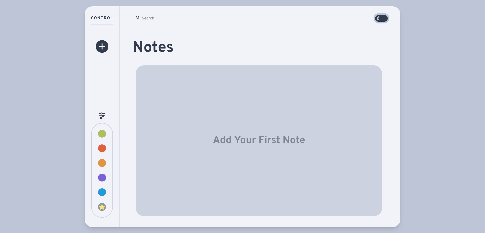
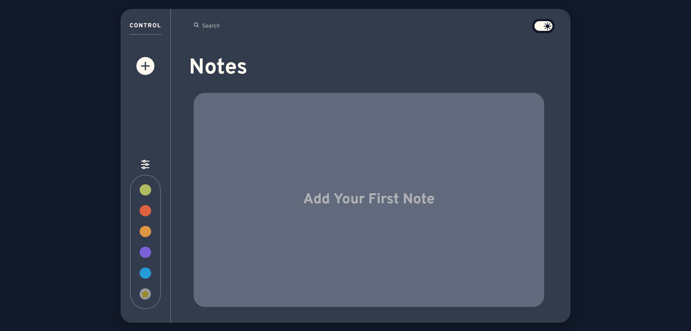
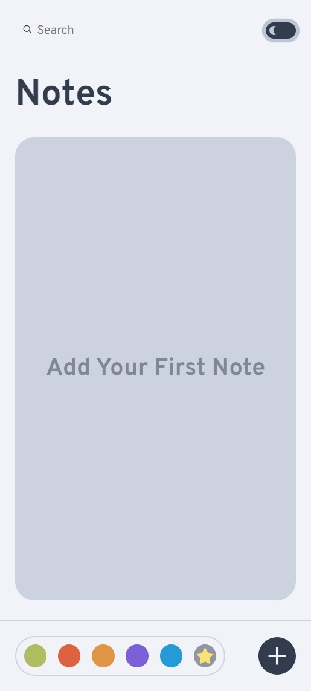

# Note Taking Web Application
This is a simple note-taking web application that uses only vanilla JavaScript and the browser's local storage API. The app allows users to create, edit, and organize their notes. Notes can be added to favorites, searched, and filtered using their color or by favorite tag. The app is responsive for all screen widths and works on all major browsers.

# Features
- Create, edit, and delete notes
- Tag notes as favorites for easy search
- Works on all major browsers
- Responsive for all screen
- Dark and Light theme
- Capability to search and filter notes

# What we used
- HTML5 semantics
- CSS
  - Grid layout
  - Flex layout
  - Custom properties
  - BEM naming convention
- JavaScript
  - Browser local storage API
  
# Screenshots
**Desktop**

**Light theme**

**Dark theme**

**Mobile**
| Light theme                                                   | Dark theme                                                  |
| ----------------------------------------------------------- | --------------------------------------------------------- |
|  |  |

# How to Use
To use the note-taking app, simply open the app in your browser. You can create a new note by clicking the ( + ) button. Once you have created a note, you can edit it by clicking the "Edit" button. You can also add notes by clicking the "add to favorite" button. You can filter the notes by their color by choosing one or more colors in the filter section. Also don't forget to try the dark theme by toggling the button next to the search bar.

